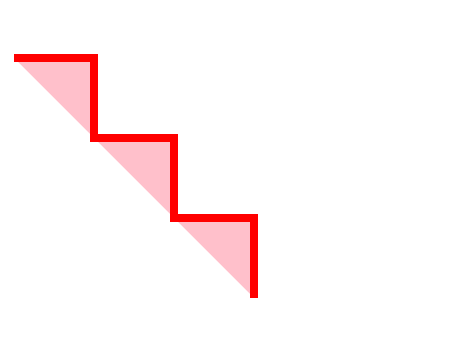

==SVG(Scalable Vector Graphics)

SGV là một ngôn ngữ dùng để mô tả đồ họa 2D và đang ngày càng phổ biến cùng với HTML5.

* Cú pháp: HTML5 cho phép dung trực tiếp thẻ <sgv>
```html
<sgv>...</sgv>
```

1. Tạo hình ảnh(Shape)

1.1 Hình tròn:

Cú pháp:

  ```html
  <sgv><circle cx=".." cy="value" r=".." stroke=".." stroke-width=".." fill=".." /></svg>
  ```
- r: bán kính hình tròn
- cx: khoảng cách từ tâm đường tròn đến mép trái của thẻ <sgv>
- cy: khoảng cách từ tâm đường tròn đến phía trên của thẻ <sgv>
- fill: màu của hình tròn
- stroke-width: độ dày đường viền
- stroke: màu của đường viền( nếu không có, hình tròn sẽ không có đường viền)

Ví dụ:

```html
<svg width="200" height="150">
  <circle cx="100" cy="75" r="70" stroke="red" stroke-width="10" fill="yellow" />
</svg>
```

Minh họa:


1.2 Hình chữ nhật:

Cú pháp:

```html
  <svg><rect width=".." height=".." fill=".." stroke=".." stroke-width=".." /></svg>
```
- width: chiều rộng
- height: chiều cao
- fill: màu của hình
- stroke-width: độ dày đường viền
- stroke: màu của đường viền

Minh họa:


1.3 Đường thẳng:

Cú pháp:

  ```html
  <svg><line x1=".." y1=".." x2=".." y2=".." stroke=".." stroke-width=".." /></svg>
  ```
- x1: điểm bắt đầu theo trục x
- x2: điểm bắt đầu theo trục x
- y1: điểm bắt đầu theo trục y
- y2: điểm bắt đầu theo trục y
- stroke-width: độ dày đường viền
- stroke: màu của đường viền

Minh họa:


1.4 Hình ellipse

Cú pháp:

  ```html
  <svg><ellipse cx=".." cy=".." rx=".." ry=".." fill=".." stroke=".." stroke-width=".." /></svg>
  ```
  
- cx: khoảng cách từ tâm đường tròn đến mép trái của thẻ <sgv>
- cy: khoảng cách từ tâm đường tròn đến phía trên của thẻ <sgv>
- rx: bán kính chiều ngang
- ry: bán kính chiều dọc
- fill: màu của hình
- stroke-width: độ dày đường viền
- stroke: màu của đường viền

Minh họa:


1.5 Hình đa giác

Cú pháp:

  ```html
  <svg><polygon points="..,.. ..,.. ..,.." fill=".." stroke= ".." stroke-width=".." /></svg>
  ```
  
- points: giá trị x và y của mỗi điểm. Một hình đa giác cần ít nhất 3 điểm hoặc nhiều hơn.
- fill: màu của hình
- stroke-width: độ dày đường viền
- stroke: màu của đường viền
Minh họa:


1.6 Đường gấp khúc

Cú pháp:

  ```html
  <svg><polyline points="..,.. ..,.. ..,.." fill=".." stroke=".." stroke-width=".." /></svg>
  ```
  
- points: giá trị x và y của mỗi điểm. Một hình đa giác cần ít nhất 3 điểm hoặc nhiều hơn.
- fill: màu của hình
- stroke-width: độ dày đường viền
- stroke: màu của đường viền

Minh họa:



1.7 Văn bản

Cú pháp:
```html
  <svg><text x=".." y=".." fill=".." transform="..">Text</text></svg>
```

- x, y: toạ độ của điểm đầu tiên của đoạn text
- transform: kiểu xoay của đoạn text

Minh họa:


2. Bộ lọc(Filters)
Filter(bộ lọc) là các thao tác đồ họa áp dụng lên một hình ảnh độ họa gốc có thểsửa đổi theo ý muốn.
Một số bộ lọc của SGV: feBlend, feColorMatrix, feComponentTransfer, feComposite, feConvolveMatrix,..
* Cú pháp:
```html
  <svg>
    <defs>
      <filter id="ID">
        <filter in=".." stdDeviation=".." />
      </filter>
    </defs>
      <phần tử SVG filter="url(#ID)" />
  </svg>
```

Minh họa:

feGaussianBlur:


feOffset, feBlend:


3. Đổ màu(Gradients)
SVG gradient cho phép đổ màu chuyển đổi màu sắc một cách liên tục, mịn từ màu này sang màu khác trên một phần từ SVG.

Có 2 loại:

3.1 linearGradient: đổ màu từ trên xuống dưới, từ trái qua phải và ngược lại.

Cú pháp:
```html
  <svg>
    <defs>
      linearGradient id="ID" x1=".." y1=".." x2=".." y2="..">
        <stop offset=".." stop-color=".." />
        <stop offset=".." stop-color=".."/>
      </linearGradient>
    </defs>
    <phần tử SVG fill="url(#ID)" />
  </svg>
```
Trong đó:
- x1, x2, y1, y2: xác định bắt đầu và kết thúc vị trí của gradient
- Phạm vi màu cho một gradient có thể được bao gồm hai hoặc nhiều màu sắc. Mỗi màu sắc được quy định với một thẻ <stop>

Minh họa:


3.2 radialGradient: đổ màu từ trung tâm ra bên ngoài.

Cú pháp:
```html
  <svg>
    <defs>
      <radialGradient id="ID" cx=".." cy=".." r=".." fx=".." fy="..">
          <stop offset=".."   stop-color=".." />
          <stop offset=".." stop-color=".."  />
      </radialGradient>
    </defs>
    <phần tử SVG fill="url(#ID)" />
  </svg>
```
Trong đó:
- cx, cy, r xác định đường tròn ngoài cùng
- fx, fy xác định đường tròn trong cùng
- Phạm vi màu cho một gradient có thể được bao gồm hai hoặc nhiều màu sắc. Mỗi màu sắc được quy định với một thẻ <stop>.

Minh họa:


